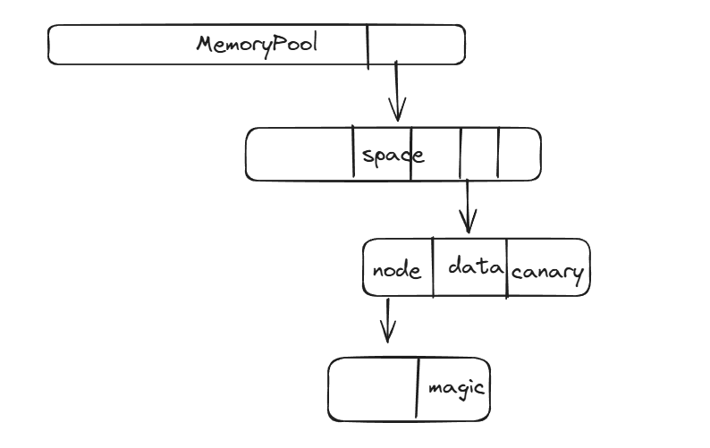

# 407Asyn_Task — 基于时间轮的轻量级软件定时器

## 项目简介

一个运行在 **STM32F407ZGTx** (Cortex-M4) 上的裸机 (bare-metal) 软件定时器框架，基于**时间轮 (Hashed Wheel Timer)** 算法实现，支持异步延迟任务和周期任务的调度与管理。

项目主要由 **TimerWheel 软件定时器** 和 **固定块内存池** 两部分组成，目标是替代裸机系统中大量 `delay`、轮询计时和临时动态分配的写法，为延迟任务、周期任务、超时检测、协议重发、传感器采样等场景提供统一的异步调度能力。

在 STM32 上，硬件定时器（TIM）是稀缺资源——PWM 等外设也要占用 TIM，且一个硬件定时器通常只能绑定一个任务，无法直接支撑大量并发的定时需求。当系统中存在较多定时任务时，软件定时器是更合适的方案，但代价是精度和实时性不如硬件定时器，需要在设计上权衡。

核心特性：

- **时间轮调度**：O(1) 插入/删除，适合大量定时任务场景
- **双时钟模式**：硬件 TIM6 自动推进 或 用户手动 tick 推进
- **跨圈任务**：支持超过时间轮一圈的超长延时任务
- **任务取消**：按任务 ID 精确取消，ID 带版本号防 ABA 问题
- **内置内存池**：预分配节点内存，避免频繁 malloc/free 碎片化

---

## 工程结构

```
407Asyn_Task/
├── User/                   # 用户应用 (main.c)
├── Timer_Wheel/            # 时间轮定时器核心
│   ├── TimerWheel.c/.h         # 时间轮实现与 API
│   ├── TimerWheel_Struct.h     # 数据结构定义
│   ├── TimerWheel_config.h/.c  # 硬件适配层 (TIM6 驱动)
│   └── TimerNode.h             # 定时器节点操作
├── MemoryPool/             # 内存池模块
│   ├── MemoryPool.c/.h         # 内存池实现
│   ├── Block_List.h            # 块链表操作
│   └── Memory_config.h         # 内存池安全检查配置
├── Func/                   # 通用工具 (错误码/宏)
├── Hardware/               # 硬件抽象层 (GPIO/USART)
├── System/                 # 系统驱动 (SysTick/延时)
├── Library/                # STM32F4 标准外设库
├── Start/                  # 启动文件
└── MDK-ARM/                # Keil MDK 工程文件
```

---

## 快速开始

### 1. 硬件说明

| 组件 | 用途 |
|------|------|
| STM32F407ZGTx | 主控 |
| USART2 (PA2/PA3, 115200) | printf 调试输出 |
| TIM6 | 时间轮硬件时钟源 (TIMER_WHEEL_MODE_TIME 模式) |
| SysTick | 系统 1ms 时基 |

### 2. 编译与烧录

项目使用 **Keil MDK (uVision 5)** + **ARMCLANG V6** 编译，直接打开 `MDK-ARM/Universal_Template.uvprojx` 即可编译。

如需 VS Code + clangd 智能提示，运行生成的 `compile_flags.txt` 已包含所需路径。

### 3. 最简使用示例

```c
#include "TimerWheel.h"
#include "TimerWheel_config.h"

// 回调函数
void* my_task(void* arg) {
    printf("task running! arg = %s\r\n", (const char*)arg);
    return NULL;
}

int main(void) {
    Sys_Tick_Init();       // 初始化 SysTick (1ms)
    Test_USART_Init();     // 初始化调试串口

    // 创建时间轮: 100ms 精度, 16 槽 (一圈 1600ms), TIM6 模式, 最大 32 任务
    TimerWheel* timer = Create_Timer_Wheel(100, 16,
                                           TIMER_WHEEL_MODE_TIME, 32);

    uint32_t id;
    // 提交一个 500ms 后执行一次的任务
    Timer_Wheel_Submit_Task(timer, my_task, "hello", 500, 1, &id);

    while (1) {
        Timer_Wheel_Loop(timer);  // 主循环中反复调用，驱动时间轮
    }
}
```

---

## API 参考

### 创建时间轮

```c
TimerWheel* Create_Timer_Wheel(
    uint16_t precision_ms,   // 时间精度 (ms)，即每个 tick 的时长
    uint16_t slot_num,       // 槽位数，必须是 2 的 n 次方，一圈时长 = precision_ms × slot_num
    uint32_t clock_mode,     // TIMER_WHEEL_MODE_TIME 或 TIMER_WHEEL_MODE_TICK
    uint16_t max_timer_num   // 最大同时存在的任务数
);
```

| 参数 | 说明 |
|------|------|
| `precision_ms` | 时间片粒度，如 100 表示每 100ms 推进一个槽 |
| `slot_num` | 槽位数，自动向下取整为 2 的 n 次方 (如 65 → 64) |
| `clock_mode` | `TIMER_WHEEL_MODE_TIME` 使用硬件 TIM6 自动计时；`TIMER_WHEEL_MODE_TICK` 需用户自行调用 |
| `max_timer_num` | 内存池中预分配的节点数，超过后提交任务会失败 |

使用函数 `TimerWheel_Adance()` 推进时间片，比如在 SysTick 中每 1ms 中断调用一次即为 `TimerWheel_Adance(timer, 1)`。

### 提交任务

```c
ERRCODE Timer_Wheel_Submit_Task(
    TimerWheel* timer,
    void* (*task)(void*),     // 回调函数
    void* arg,                // 回调参数
    uint32_t interval_ms,     // 间隔时间 (ms)
    int repeat,               // 重复次数
    uint32_t* timer_id        // [出参] 任务 ID
);
```

**`repeat` 参数说明：**

| repeat 值 | 行为 |
|-----------|------|
| `0` | **立即执行**：同步调用回调，不进入时间轮，返回 `timer_id = 0xFFFFFFFF` |
| `1` | 延迟 `interval_ms` 后执行 **1 次** |
| `2 ~ 65534` | 每隔 `interval_ms` 执行一次，共执行 `repeat` 次 |
| `FOREVER` (0xFFFF) | 每隔 `interval_ms` **永久循环执行** |

```c
uint32_t id;

// 一次性延迟任务：1000ms 后执行一次
Timer_Wheel_Submit_Task(timer, callback, arg, 1000, 1, &id);

// 周期任务：每 500ms 执行一次，共 5 次
Timer_Wheel_Submit_Task(timer, callback, arg, 500, 5, &id);

// 永久循环任务：每 2000ms 执行一次
Timer_Wheel_Submit_Task(timer, callback, arg, 2000, FOREVER, &id);

// 立即执行：不等时间轮，立刻调用回调
Timer_Wheel_Submit_Task(timer, callback, arg, 0, 0, &id);
```

### 取消任务

```c
ERRCODE Timer_Wheel_Cancel_Task(TimerWheel* timer, uint32_t id);
```

通过提交任务时返回的 `timer_id` 取消指定任务。

```c
uint32_t id;
Timer_Wheel_Submit_Task(timer, callback, arg, 3000, 1, &id);
Timer_Wheel_Cancel_Task(timer, id);  // 立即取消，回调不会被触发
```

> 任务 ID 由内存池索引 (高 16 位) + 版本号 (低 16 位) 组成，具备防 ABA 能力——即使同一块内存被新任务复用，旧 ID 也无法取消新任务。

### 主循环驱动

```c
ERRCODE Timer_Wheel_Loop(TimerWheel* timer);
```

**必须在主循环 `while(1)` 中反复调用**，该函数负责：

- 检查当前槽是否有到期任务
- 执行到期任务的回调
- 处理周期任务的重新入队
- 推进时间轮槽位 (TICK 模式下)

```c
while (1) {
    Timer_Wheel_Loop(timer);
    // 其他用户代码 ...
}
```

### 其他 API

```c
void Timer_Wheel_Show(const TimerWheel* timer);   // 打印统计信息
void Timer_Wheel_Stop(TimerWheel* timer);          // 暂停时间轮
void Timer_Wheel_Destory(TimerWheel** timer);      // 销毁时间轮，释放资源

// 仅 TICK 模式使用：手动推进时间轮 add_ms 毫秒
void TimerWheel_Adance(TimerWheel* timer, uint32_t Add_ms);
```

---

## 设计原理

### 时间轮：从时间片到跨圈调度

时间轮的设计是逐步叠加约束推导出来的：

1. **时间片**：既然是定时任务，就需要一个周期性的"事件检查点"。用固定长度的时间片作为最小调度粒度，每经过一个时间片就检查一次是否有任务到期。

2. **槽 (slot)**：需要一个地方存放"在某个时间片到期"的任务。用数组实现槽结构，下标对应时间片编号——例如 `slot[2]` 存放的就是第 2 个时间片到期的任务，时间轮推进到第 2 个时间片时直接取出该槽执行。

3. **引入轮次 (round)**：如果槽数组按最长延时设计（比如支持 10000ms 延迟就要开 10000 个槽），会造成极大的空间浪费。解决办法是给每个任务附加一个 `round` 字段，表示"还需要转多少整圈才轮到它执行"。判断任务是否到期需要同时满足：当前处于任务所在的槽，且 `round == 0`。这样槽数量只需覆盖一圈的时长，超长延时任务通过 `round` 折叠表示。

4. **链表结构**：引入 `round` 之后，同一个槽里可能同时存在多个不同轮次到期的任务，因此每个槽需要维护一个任务链表。由于需要支持随机插入和删除（如任务取消），选用**双向链表**。每次提交任务时返回一个任务 ID，这个 ID 实际上对应内存池中的内存块编号，可以 O(1) 定位到具体任务节点，这也是"取消任务"功能的实现基础。

时间轮的**一圈时长** = `precision_ms × slot_num`。当任务的 `interval_ms` 超过一圈时长时，任务会被打上 `round` 标记暂存在对应槽位，时间轮转过对应圈数后 `round` 减为 0，才真正执行。

例如：`precision_ms = 500, slot_num = 8`，一圈为 `4000ms`。提交一个 `5000ms` 延迟的任务 → 槽位计算后 `round = 1`，时间轮需要转过该槽一次（跨一圈）后，`round` 减为 0 才真正执行。

### 内存池：为什么不直接用 malloc/free

时间轮节点频繁申请和释放，如果直接依赖标准库 `malloc/free`，会有两个问题：

1. **`malloc/free` 本身不稳定**。STM32 的堆以链表形式组织空闲块，分配时要遍历链表寻找合适大小的块（首次适配 / 最佳适配），这个过程是 O(n)，且随着碎片增多会越来越慢，在实时性要求较高的场景下不可控。

2. **朴素的数组复用方案同样不理想**。如果用数组来复用固定大小的内存块，"哪个位置空闲"这件事本身需要遍历数组查找，复用的定位成本仍是 O(n)。

核心问题因此变成：**如何用 O(1) 的代价识别并管理"哪些块空闲、哪些块在用"**。

自然的思路是维护一条空闲链表（free list）记录所有空闲块。但如果这条链表是"外挂"的——节点信息单独存放在别处——那么从链表中摘除一个节点时，仍然需要先查找它在链表中的位置，删除操作还是退化成 O(n)。

**解决办法是使用侵入式链表 (intrusive linked list)**：一块内存在"空闲"状态下并没有存有效数据，因此可以直接把链表节点（`next` 指针等）复用这块内存本身的空间来存储，而不额外分配空间去描述它。这样一来：

- 每个空闲块本身就是链表节点，拿到块地址就等于拿到了节点地址，不需要额外查找；
- 从空闲链表中摘除 / 插入某个块，只需要 O(1) 的指针操作；
- 因为是裸机环境，内存布局完全由自己掌控，甚至可以反向通过数据指针推算出所在结构体的地址（类似 Linux 内核 `container_of` 的思路），实现"用户拿到的指针"和"内部管理结构"之间的闭环转换，不需要额外的映射表。

最终效果：分配 / 释放都是 O(1)，且因为内存池按固定大小的块管理（而非像通用堆那样处理任意大小请求），不会产生外部碎片。



---

## 两种时钟模式

### TIMER_WHEEL_MODE_TIME (推荐)

使用 STM32 硬件 TIM6 定时器自动推进时间轮，无需用户干预。

**自适应调速策略**：TIM6 中断周期根据距离下一个 tick 的时间动态调整：

| 距离下次 tick | TIM6 检查间隔 |
|--------------|--------------|
| > 10s | 10s |
| 1s ~ 10s | 1s |
| 100ms ~ 1s | 100ms |
| 10ms ~ 100ms | 10ms |

这样在兼顾精度的同时降低了 CPU 中断频率。

```c
// 使用 TIM6 模式
TimerWheel* timer = Create_Timer_Wheel(100, 16,
                                       TIMER_WHEEL_MODE_TIME, 32);
```

### TIMER_WHEEL_MODE_TICK

用户自行在某个定时中断或主循环中调用 `TimerWheel_Adance()` 推进时间轮。适合已有系统 tick 的场景，代价是精度和实时性依赖用户调用的及时性，不如硬件定时器稳定。

```c
// 创建时指定 TICK 模式
TimerWheel* timer = Create_Timer_Wheel(100, 16,
                                       TIMER_WHEEL_MODE_TICK, 32);

// 在 SysTick 中断或主循环中手动推进
void SysTick_Handler(void) {
    TimerWheel_Adance(timer, 1);  // 每次推进 1ms
}
```

---

## 内存池安全检查

内存池内置了多种运行时安全检查，通过 `Memory_config.h` 配置：

| 宏 | 默认值 | 功能 | 实现原理 |
|----|-------|------|---------|
| `MEMPOOL_MAGIC` | 1 | 块头部魔数校验 (`0xDEADC0DE`)，检测向前越界 | 每个块头部写入固定魔数，访问前校验是否被覆盖 |
| `MEMPOOL_CANARY` | 1 | 块尾部金丝雀校验 (`0xCAFEBABE`)，检测向后越界 | 数据区末尾放置标识符，若被破坏说明发生了向后越界写入；注意末尾 padding 部分的修改无法被识别 |
| `MEMPOOL_CHECK_FREE` | 1 | 检测重复释放 (double-free) | 依据节点内部的 `state` 字段判断该节点是否已被释放过 |
| `MEMPOOL_WILD_FREE_CHECK` | 1 | 检测野指针释放 | 校验指针的 `owner` 是否指向合法的 chunk；STM32 没有 MMU、只有 MPU，无法做到完全的内存越界保护，但通过只读校验可以识别出大部分野指针，不会修改被怀疑的野指针本身，从而保证检查过程自身的安全性 |
| `OBSERVER_MODE` | 1 | 统计峰值使用、分配失败、越界次数等 | 运行期维护统计计数器 |

> 发布版可关闭这些检查以减小代码体积和运行时开销。

---

## 运行测试

项目 `main.c` 包含完整的测试用例，烧录后通过串口 (USART2, 115200) 观察输出：

```
========== TimerWheel Test Start ==========
tick_ms = 500ms, slot_num = 8, wheel_cycle = 4000ms

[0 ms] immediate task run             ← repeat=0，立即执行
[1000 ms] oneshot 1000ms run          ← 延迟 1000ms，执行 1 次
[1500 ms] repeat 3 times every 1500ms run  ← 第 1 次
[2000 ms] forever every 2000ms run    ← 永久循环第 1 次
[3000 ms] repeat 3 times every 1500ms run  ← 第 2 次
[4000 ms] forever every 2000ms run    ← 第 2 次
[4500 ms] repeat 3 times every 1500ms run  ← 第 3 次 (完成)
[5000 ms] cross-round oneshot 5000ms run   ← 跨圈任务
[6000 ms] forever every 2000ms run    ← 第 3 次
[7000 ms] cancel forever task         ← 主动取消
========== TimerWheel Test Finish ==========
```

测试覆盖了：立即执行、延迟执行、周期执行、跨圈任务、任务取消、永久循环等全部场景。

---

## 依赖关系

```
TimerWheel ──→ MemoryPool ──→ Error (错误码系统)
     │
     └──→ Hardware/TIM6 (仅 MODE_TIME 模式)
```

所有模块均为自研，除 STM32 标准外设库外无第三方依赖。

---

## 常见问题

**Q: 任务回调中能否提交新任务？**
A: 可以。到期任务的回调在 `Timer_Wheel_Loop()` 中同步调用，可以安全地创建新任务或取消其他任务。

**Q: 回调函数内部不能做什么？**
A: 回调在 `Timer_Wheel_Loop()` 上下文中执行，不是中断上下文。应避免长时间阻塞，否则会延迟其他到期任务的执行。

**Q: TICK 模式下多久调用一次 `TimerWheel_Adance()`？**
A: 取决于精度需求。若精度为 100ms，可在 1ms SysTick 中每次累加 1ms 然后调用；也可在 10ms 定时中断中每次推进 10ms。只需保证 `Add_ms` 是真实经过的毫秒数。

**Q: 最多能提交多少个任务？**
A: 由 `max_timer_num` 决定，超过后 `Timer_Wheel_Submit_Task` 返回 `ERR_MEMPOOL_OUT`。
